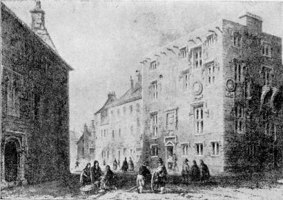

# Hardiman's History of Galway

Static HTML edition of James Hardiman's *The History of the Town and County
of the Town of Galway. From the Earliest Period to the Present Time*, first
published in Dublin by W. Folds & Sons in 1820.

Read it online:

https://jdesbonnet.github.io/history-of-galway-hardiman/

*Lynch's Castle, Galway — one of the engravings included with the text.*

## About

This repository preserves a OCRed scan of Hardiman's early nineteenth
century history of Galway. This project was first started by myself 
(Joe Desbonnet) in 1995.

Hardiman's work is a major early printed history of Galway, covering the town's
name, the "Tribes of Galway", medieval and early modern civic history, religious
institutions, public buildings, trade, fisheries, charities, markets, and the
state of the town as it stood in Hardiman's own time.

## Copyright Status

The underlying book is out of copyright: it was published in 1820 and James
Hardiman died in 1855. 

## Notes For Readers

- Treat this as an OCR/transcription copy, not a proofed scholarly edition.
- Expect typographical errors and occasional HTML quirks inherited from the
  1995 markup.
- For citation or close reading, compare important passages against a scan or
  printed edition.

## External References

- [Hardiman's History of Galway](https://en.wikipedia.org/wiki/Hardiman%27s_History_of_Galway)
- [James Hardiman](https://en.wikipedia.org/wiki/James_Hardiman)
- [History of Galway](https://en.wikipedia.org/wiki/History_of_Galway)
